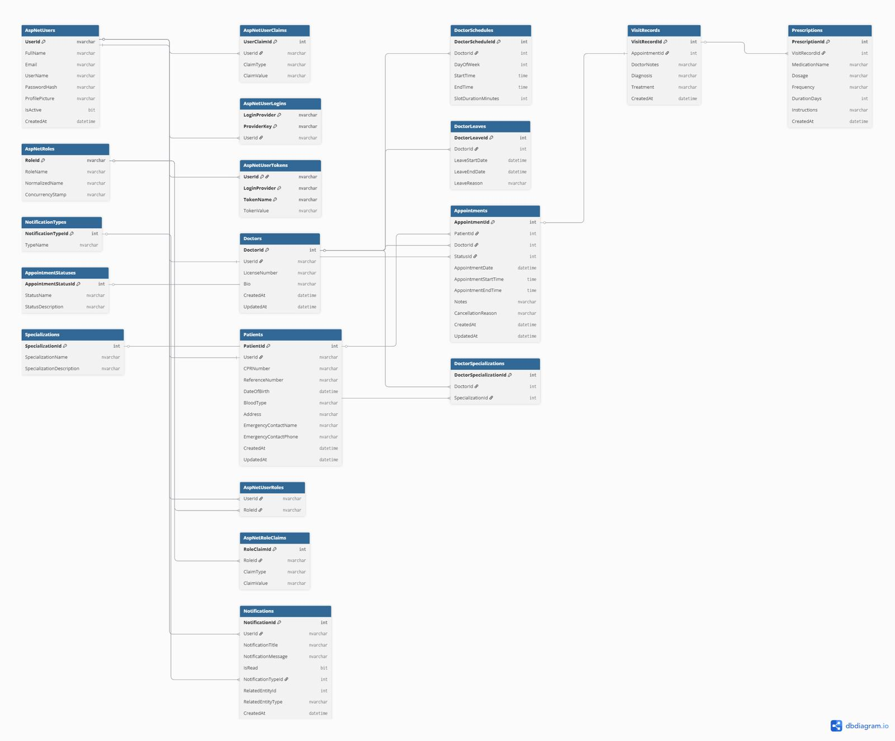

# GentleCare

## Care that feels personal, simple, and close to you

GentleCare is a web-based healthcare clinic management system built using ASP.NET Core. The system helps a clinic manage appointments, doctors, patients, schedules, medical records, prescriptions, notifications, clinic announcements, account access, and operational reports.

The system is designed to reduce manual scheduling problems, prevent double-booking, improve appointment tracking, and give the clinic manager clear operational visibility.

---

## Project Overview

GentleCare supports the full clinic workflow from appointment booking to completed visit records.

Patients and receptionists can book appointments by selecting specialization, doctor, date, and available time slot. Doctors can view appointments, update status, create visit records, record prescriptions, and request follow-up appointments. Clinic managers can manage doctors, schedules, leaves, appointments, accounts, reports, notifications, and announcements.

---

## Team Members

| Student ID | Name |
|---|---|
| 202304661 | Fatema Maitham |
| 202305590 | Maram Shubbar |
| 202300641 | Malak Almajed |
| 202302211 | Zainab Almahdi |
| 202302702 | Kawther Abdulla |

---

## Roles and Responsibilities

| Member | Role | Work Owned |
|---|---|---|
| Fatema Maitham | MVC Developer | Clinic Manager MVC features including dashboard, doctor management, schedule management, appointment management, reports dashboard, account activation/deactivation controls, clinic announcements, doctor follow-up request workflow, and appointment workflow improvements. |
| Maram Shubbar | MVC Developer | Patient MVC pages including dashboard, booking, appointments, visit history, prescriptions, profile management. Receptionist MVC pages including dashboard, booking, appointment status management, live queue. Doctor MVC pages for appointment viewing and status updates. Role-based dashboards, authentication-related MVC views, and clinic workflow features. |
| Malak Almajed | API and Backend Developer | RESTful Web API design and implementation, EF Core database layer and entity relationships, JWT authentication and token service, public appointment lookup endpoint, API security, and backend integration with MVC application. |
| Zainab Almahdi | UI/UX Designer | Layout styling, responsiveness across all devices, navigation improvements, consistent design system, overall user experience enhancement, and visual design for all role-based interfaces. |
| Kawther Abdulla | Reporting Developer | Reporting application development, HttpClient API consumption for data retrieval, report views and dashboards, and read-only reporting enforcement for secure data access. |

---

## System Roles

| Role | Description |
|---|---|
| Clinic Manager | Manages doctors, schedules, leaves, appointments, accounts, reports, notifications, and announcements. |
| Receptionist | Books appointments, manages appointment flow, handles check-ins, and monitors appointment queue. |
| Doctor | Views assigned appointments, updates status, creates visit records, records prescriptions, and creates follow-up requests. |
| Patient | Books appointments, views upcoming appointments, visit history, prescriptions, and notifications. |

---

## ERD

The ERD represents the main GentleCare database structure, including users, roles, doctors, patients, appointments, schedules, leaves, specializations, visit records, prescriptions, and notifications.



---

## Database Design Summary

| Table                 | Purpose                                                                                                               |
| --------------------- | --------------------------------------------------------------------------------------------------------------------- |
| AspNetUsers           | Stores login users, full names, emails, passwords, profile pictures, active status, and created date.                 |
| AspNetRoles           | Stores system roles such as Clinic Manager, Doctor, Receptionist, and Patient.                                        |
| AspNetUserRoles       | Links users to roles.                                                                                                 |
| AspNetUserClaims      | Stores user claims used by ASP.NET Identity.                                                                          |
| AspNetRoleClaims      | Stores role claims used by ASP.NET Identity.                                                                          |
| AspNetUserLogins      | Stores external login information if used.                                                                            |
| AspNetUserTokens      | Stores authentication tokens if used.                                                                                 |
| Doctors               | Stores doctor profile data linked to an Identity user.                                                                |
| Patients              | Stores patient profile data, CPR number, reference number, date of birth, blood type, address, and emergency contact. |
| Specializations       | Stores clinic specialization names and descriptions.                                                                  |
| DoctorSpecializations | Many-to-many table linking doctors to multiple specializations.                                                       |
| DoctorSchedules       | Stores doctor working day, start time, end time, and slot duration.                                                   |
| DoctorLeaves          | Stores doctor leave periods and leave reasons.                                                                        |
| AppointmentStatuses   | Stores appointment workflow statuses.                                                                                 |
| Appointments          | Stores appointment date, time, patient, doctor, status, notes, cancellation reason, and timestamps.                   |
| VisitRecords          | Stores doctor notes, diagnosis, treatment, and completed visit details.                                               |
| Prescriptions         | Stores medication name, dosage, frequency, duration, and instructions linked to visit records.                        |
| NotificationTypes     | Stores notification categories.                                                                                       |
| Notifications         | Stores in-system notifications for users.                                                                             |

---

## Detailed Project Structure

```text
HCARS/
│
├── HCARS.sln                                      // Visual Studio solution file
├── README.md                                      // Project documentation
├── schema.sql                                     // SQL script for database schema
├── seed.sql                                       // SQL script for seeded test data
│
├── WebAPI/                                        // ASP.NET Core Web API and shared data layer
│   │
│   ├── WebAPI.csproj                              // Web API project file
│   ├── Program.cs                                 // API startup, services, middleware, authentication, SignalR
│   ├── appsettings.json                           // API configuration and connection string
│   ├── appsettings.Development.json               // Development configuration
│   ├── WebAPI.http                                // API testing requests
│   ├── WeatherForecast.cs                         // Default generated weather model
│   │
│   ├── Controllers/                               // API controllers
│   │   ├── AppointmentController.cs               // Appointment API endpoints
│   │   ├── AuthController.cs                      // Login and JWT authentication endpoints
│   │   ├── DoctorController.cs                    // Doctor-related API endpoints
│   │   ├── PatientController.cs                   // Patient-related API endpoints
│   │   ├── ReportController.cs                    // Report data endpoints
│   │   └── WeatherForecastController.cs           // Default generated test controller
│   │
│   ├── DTO/                                       // API data transfer objects
│   │   └── DTO files                              // Request and response shapes for API communication
│   │
│   ├── Data/                                      // Database configuration and seeding
│   │   ├── ApplicationDbContext.cs                // EF Core DbContext and database relationships
│   │   └── DbSeeder.cs                            // Seeds users, roles, doctors, patients, statuses, and test data
│   │
│   ├── Hubs/                                      // SignalR hubs
│   │   └── AppointmentHub.cs                      // Real-time appointment and queue update hub
│   │
│   ├── Migrations/                                // EF Core migrations
│   │   └── migration files                        // Auto-generated database migration files
│   │
│   ├── Models/                                    // Database entity models
│   │   ├── ApplicationUser.cs                     // Identity user extension with profile and active status
│   │   ├── Appointment.cs                         // Appointment entity with patient, doctor, status, date, and time
│   │   ├── AppointmentStatusLookup.cs             // Appointment status lookup entity
│   │   ├── Doctor.cs                              // Doctor profile entity
│   │   ├── DoctorLeave.cs                         // Doctor leave entity
│   │   ├── DoctorSchedule.cs                      // Doctor weekly schedule entity
│   │   ├── DoctorSpecialization.cs                // Doctor and specialization link entity
│   │   ├── Notification.cs                        // User notification entity
│   │   ├── NotificationType.cs                    // Notification type lookup entity
│   │   ├── Patient.cs                             // Patient profile entity
│   │   ├── Prescription.cs                         // Prescription entity linked to visit records
│   │   ├── Specialization.cs                      // Medical specialization entity
│   │   └── VisitRecord.cs                         // Visit record entity for completed appointments
│   │
│   ├── Properties/                                // Project launch settings
│   │   └── launchSettings.json                    // Local run profiles
│   │
│   └── Services/                                  // API services
│       ├── NotificationHubService.cs             // Sends real-time notification updates through SignalR
│       └── TokenService.cs                       // Creates JWT tokens for authenticated users
│
│
├── MVCApp/                                        // ASP.NET Core MVC user-facing application
│   │
│   ├── MVCApp.csproj                              // MVC project file
│   ├── Program.cs                                 // MVC startup, services, Identity, EF Core, routing, session
│   ├── appsettings.json                           // MVC configuration and connection string
│   ├── appsettings.Development.json               // Development configuration
│   │
│   ├── Controllers/                               // MVC page controllers
│   │   ├── AccountController.cs                   // Login, logout, access denied, and account logic
│   │   ├── AppointmentController.cs               // Appointment booking and appointment-related MVC pages
│   │   ├── ClinicManagerController.cs             // Clinic Manager dashboard, doctors, schedules, reports, accounts, announcements
│   │   ├── DashboardController.cs                 // Role-based dashboard routing
│   │   ├── DoctorAppointmentController.cs         // Doctor appointment list, details, status, history, and follow-up requests
│   │   ├── DoctorController.cs                    // Doctor dashboard, schedule, profile, and notifications
│   │   ├── PatientController.cs                   // Patient dashboard, booking, appointments, history, and profile
│   │   ├── PrescriptionController.cs              // Prescription pages and actions
│   │   ├── PublicController.cs                    // Public appointment lookup page using API
│   │   ├── ReceptionistController.cs              // Receptionist appointment and queue workflow
│   │   └── VisitRecordController.cs               // Visit record creation and editing
│   │
│   ├── Models/                                    // General MVC models
│   │   └── ErrorViewModel.cs                      // Error page model
│   │
│   ├── Services/                                  // Business logic services
│   │   ├── AppointmentWorkflowService.cs          // Appointment status workflow and valid transition rules
│   │   ├── ClinicManagerService.cs                // Clinic Manager business logic
│   │   ├── DoctorAppointmentService.cs            // Doctor appointment, history, and follow-up logic
│   │   ├── DoctorDashboardService.cs              // Doctor dashboard, schedule, profile, and notifications logic
│   │   ├── NotificationService.cs                 // Creates and reads in-system notifications
│   │   ├── PatientService.cs                      // Patient dashboard, booking, profile, and history logic
│   │   ├── PrescriptionService.cs                 // Prescription business logic
│   │   ├── VisitRecordService.cs                  // Visit record and treatment logic
│   │   │
│   │   └── Interfaces/                            // Service contracts
│   │       ├── IAppointmentWorkflowService.cs     // Appointment workflow service interface
│   │       ├── IClinicManagerService.cs           // Clinic Manager service interface
│   │       ├── IDoctorAppointmentService.cs       // Doctor appointment service interface
│   │       ├── IDoctorDashboardService.cs         // Doctor dashboard service interface
│   │       ├── INotificationService.cs            // Notification service interface
│   │       ├── IPatientService.cs                 // Patient service interface
│   │       ├── IPrescriptionService.cs            // Prescription service interface
│   │       └── IVisitRecordService.cs             // Visit record service interface
│   │
│   ├── ViewModels/                                // Strongly typed page models
│   │   │
│   │   ├── Appointment/                           // Appointment view models
│   │   │   └── appointment view model files       // Appointment booking and display models
│   │   │
│   │   ├── ClinicManager/                         // Clinic Manager view models
│   │   │   ├── AppointmentImpactViewModel.cs      // Affected appointment review model
│   │   │   ├── ClinicAnnouncementViewModel.cs     // Announcement creation model
│   │   │   ├── ClinicManagerAppointmentDetailsViewModel.cs    // Manager appointment details model
│   │   │   ├── ClinicManagerAppointmentItemViewModel.cs       // Appointment list item model
│   │   │   ├── ClinicManagerAppointmentStatusViewModel.cs     // Manager status update model
│   │   │   ├── ClinicManagerAppointmentsViewModel.cs          // Manager appointment list page model
│   │   │   ├── ClinicManagerDashboardViewModel.cs             // Manager dashboard summary model
│   │   │   ├── ClinicManagerDoctorDetailsViewModel.cs         // Doctor details model
│   │   │   ├── ClinicManagerDoctorListItemViewModel.cs        // Doctor row model
│   │   │   ├── ClinicManagerDoctorListViewModel.cs            // Doctor list page model
│   │   │   ├── ClinicManagerNotificationViewModel.cs          // Manager notification model
│   │   │   ├── ClinicManagerProfileViewModel.cs               // Manager profile model
│   │   │   ├── ClinicManagerUserAccountsViewModel.cs          // Account activation and deactivation model
│   │   │   ├── ClinicReportItemViewModel.cs                   // Doctor utilization report row model
│   │   │   ├── ClinicReportViewModel.cs                       // Full reports dashboard model
│   │   │   ├── DoctorCreateViewModel.cs                       // Create doctor form model
│   │   │   ├── DoctorEditViewModel.cs                         // Edit doctor form model
│   │   │   ├── DoctorLeaveFormViewModel.cs                    // Doctor leave form model
│   │   │   ├── DoctorLeaveItemViewModel.cs                    // Doctor leave row model
│   │   │   ├── DoctorScheduleFormViewModel.cs                 // Doctor schedule form model
│   │   │   ├── DoctorScheduleItemViewModel.cs                 // Doctor schedule row model
│   │   │   ├── EditClinicManagerProfileViewModel.cs           // Edit manager profile model
│   │   │   ├── ImpactedAppointmentItemViewModel.cs            // Impacted appointment row model
│   │   │   ├── ManageDoctorLeavesViewModel.cs                 // Manage doctor leaves page model
│   │   │   ├── ManageDoctorScheduleViewModel.cs               // Manage doctor schedule page model
│   │   │   ├── ManageDoctorSpecializationsViewModel.cs        // Manage specializations page model
│   │   │   └── SpecializationSelectionViewModel.cs            // Specialization checkbox model
│   │   │
│   │   ├── Doctor/                                // Doctor view models
│   │   │   ├── CreateFollowUpRequestViewModel.cs  // Follow-up appointment request form model
│   │   │   ├── CreateVisitRecordViewModel.cs      // Create visit record model
│   │   │   ├── DoctorAppointmentDetailsViewModel.cs           // Doctor appointment details model
│   │   │   ├── DoctorAppointmentListItemViewModel.cs          // Doctor appointment row model
│   │   │   ├── DoctorAppointmentListViewModel.cs              // Doctor appointments page model
│   │   │   ├── DoctorDashboardViewModel.cs                    // Doctor dashboard model
│   │   │   ├── DoctorNotificationsViewModel.cs                // Doctor notifications model
│   │   │   ├── DoctorPatientHistoryViewModel.cs               // Doctor patient history model
│   │   │   ├── DoctorPrescriptionViewModel.cs                 // Doctor prescription display model
│   │   │   ├── DoctorProfileViewModel.cs                      // Doctor profile model
│   │   │   ├── DoctorScheduleItemViewModel.cs                 // Doctor schedule item model
│   │   │   ├── DoctorScheduleViewModel.cs                     // Doctor schedule page model
│   │   │   ├── EditDoctorProfileViewModel.cs                  // Edit doctor profile model
│   │   │   ├── EditVisitRecordViewModel.cs                    // Edit visit record model
│   │   │   ├── PrescriptionInputViewModel.cs                  // Prescription input model
│   │   │   ├── UpdateAppointmentStatusViewModel.cs            // Doctor status update model
│   │   │   └── VisitRecordDetailsViewModel.cs                 // Visit record details model
│   │   │
│   │   ├── Patient/                               // Patient view models
│   │   │   ├── PatientAppointmentsViewModel.cs    // Patient appointment list model
│   │   │   ├── PatientBookAppointmentViewModel.cs // Patient booking form model
│   │   │   ├── PatientDashboardViewModel.cs       // Patient dashboard model
│   │   │   ├── PatientEditProfileViewModel.cs     // Edit patient profile model
│   │   │   ├── PatientHistoryViewModel.cs         // Patient visit history model
│   │   │   ├── PatientProfileViewModel.cs         // Patient profile model
│   │   │   └── PrescriptionItemViewModel.cs       // Prescription row model
│   │   │
│   │   ├── Public/                                // Public lookup view models
│   │   │   └── PublicAppointmentLookupViewModel.cs // Public lookup result model
│   │   │
│   │   └── Receptionist/                          // Receptionist view models
│   │       ├── ReceptionistAppointmentListItemViewModel.cs     // Receptionist appointment row model
│   │       ├── ReceptionistAppointmentsPageViewModel.cs        // Receptionist appointment page model
│   │       ├── ReceptionistBookAppointmentViewModel.cs         // Receptionist booking model
│   │       ├── ReceptionistDashboardViewModel.cs               // Receptionist dashboard model
│   │       └── ReceptionistUpdateAppointmentStatusViewModel.cs // Receptionist status update model
│   │
│   ├── Views/                                     // Razor views
│   │   │
│   │   ├── Account/                               // Account pages
│   │   │   ├── AccessDenied.cshtml                // Access denied page
│   │   │   └── Login.cshtml                       // Login page
│   │   │
│   │   ├── Appointment/                           // Appointment pages
│   │   │   └── appointment views                  // General appointment views
│   │   │
│   │   ├── ClinicManager/                         // Clinic Manager pages
│   │   │   ├── AppointmentDetails.cshtml          // Manager appointment details page
│   │   │   ├── AppointmentImpact.cshtml           // Affected appointment review page
│   │   │   ├── Appointments.cshtml                // Manager appointment list page
│   │   │   ├── CreateAnnouncement.cshtml          // Manager announcement form page
│   │   │   ├── CreateDoctor.cshtml                // Create doctor page
│   │   │   ├── CreateDoctorLeave.cshtml           // Create doctor leave page
│   │   │   ├── CreateDoctorSchedule.cshtml        // Create doctor schedule page
│   │   │   ├── Dashboard.cshtml                   // Manager dashboard page
│   │   │   ├── DoctorDetails.cshtml               // Doctor details page
│   │   │   ├── Doctors.cshtml                     // Doctor list page
│   │   │   ├── EditDoctor.cshtml                  // Edit doctor page
│   │   │   ├── EditDoctorLeave.cshtml             // Edit doctor leave page
│   │   │   ├── EditDoctorSchedule.cshtml          // Edit doctor schedule page
│   │   │   ├── EditProfile.cshtml                 // Edit manager profile page
│   │   │   ├── ManageDoctorLeaves.cshtml          // Manage doctor leaves page
│   │   │   ├── ManageDoctorSchedule.cshtml        // Manage doctor schedules page
│   │   │   ├── ManageDoctorSpecializations.cshtml // Manage doctor specializations page
│   │   │   ├── Notifications.cshtml               // Manager notifications page
│   │   │   ├── Profile.cshtml                     // Manager profile page
│   │   │   ├── Reports.cshtml                     // Manager reports dashboard
│   │   │   ├── UpdateAppointmentStatus.cshtml     // Manager appointment status update page
│   │   │   └── UserAccounts.cshtml                // User activation and deactivation page
│   │   │
│   │   ├── Dashboard/                             // Shared dashboard pages
│   │   │   └── dashboard views                    // Role routing or dashboard support views
│   │   │
│   │   ├── Doctor/                                // Doctor pages
│   │   │   ├── AppointmentDetails.cshtml          // Doctor appointment details page
│   │   │   ├── Appointments.cshtml                // Doctor appointment list page
│   │   │   ├── CreateFollowUpRequest.cshtml       // Follow-up request form page
│   │   │   ├── CreateVisitRecord.cshtml           // Create visit record page
│   │   │   ├── Dashboard.cshtml                   // Doctor dashboard page
│   │   │   ├── EditProfile.cshtml                 // Edit doctor profile page
│   │   │   ├── EditVisitRecord.cshtml             // Edit visit record page
│   │   │   ├── Notifications.cshtml               // Doctor notifications page
│   │   │   ├── PatientHistory.cshtml              // Patient history page for doctor
│   │   │   ├── Prescriptions.cshtml               // Doctor prescriptions page
│   │   │   ├── Profile.cshtml                     // Doctor profile page
│   │   │   ├── Schedule.cshtml                    // Doctor schedule page
│   │   │   └── UpdateStatus.cshtml                // Doctor appointment status update page
│   │   │
│   │   ├── Patient/                               // Patient pages
│   │   │   ├── Appointments.cshtml                // Patient appointments page
│   │   │   ├── BookAppointment.cshtml             // Patient booking page
│   │   │   ├── Dashboard.cshtml                   // Patient dashboard page
│   │   │   ├── EditProfile.cshtml                 // Edit patient profile page
│   │   │   ├── History.cshtml                     // Patient visit history page
│   │   │   └── Profile.cshtml                     // Patient profile page
│   │   │
│   │   ├── Public/                                // Public pages
│   │   │   └── Lookup.cshtml                      // Public appointment lookup page
│   │   │
│   │   ├── Receptionist/                          // Receptionist pages
│   │   │   ├── Appointments.cshtml                // Receptionist appointments page
│   │   │   ├── BookAppointment.cshtml             // Receptionist booking page
│   │   │   ├── Index.cshtml                       // Receptionist dashboard page
│   │   │   └── UpdateStatus.cshtml                // Receptionist status update page
│   │   │
│   │   └── Shared/                                // Shared layout and partial views
│   │       ├── _AlertMessages.cshtml              // Shared alert message partial
│   │       ├── Error.cshtml                       // Error page
│   │       ├── _Layout.cshtml                     // Main site layout
│   │       ├── _Layout.cshtml.css                 // Layout-scoped styles
│   │       ├── _Navbar.cshtml                     // Role-aware navigation bar
│   │       └── _ValidationScriptsPartial.cshtml   // Client-side validation scripts
│   │
│   ├── wwwroot/                                   // Static web assets
│   │   ├── css/
│   │   │   └── site.css                           // Main site CSS
│   │   ├── js/
│   │   │   └── site.js                            // Main site JavaScript
│   │   ├── images/                                // Uploaded and static images
│   │   └── lib/                                   // Client libraries
│   │
│   └── Properties/
│       └── launchSettings.json                    // MVC local run profiles
```

---

## System Features

| Feature               | Description                                                                                                           |
| --------------------- | --------------------------------------------------------------------------------------------------------------------- |
| Appointment Booking   | Patients or receptionists can book appointments by specialization, doctor, date, and available time slot.             |
| Appointment Lifecycle | Appointments follow a workflow from Requested to Confirmed, Checked-In, In Progress, Completed, Cancelled, or Missed. |
| Doctor Scheduling     | Clinic Manager manages doctor working days, working hours, slot duration, and leave periods.                          |
| Patient Records       | Doctors create visit records for completed appointments, including notes, diagnosis, and treatment.                   |
| Prescription Tracking | Prescriptions are linked to visit records and can be viewed by patients and doctors.                                  |
| Role-Based Access     | Each role has its own pages and permissions.                                                                          |
| Public Lookup         | Patients can check upcoming appointments and recent visit summary using CPR and reference number without logging in.  |
| Real-Time Updates     | SignalR supports live queue updates and appointment status changes.                                                   |
| Reporting             | Clinic Manager can view advanced operational reports.                                                                 |
| Notifications         | Users receive in-system notifications for appointment and clinic events.                                              |

---

## Clinic Manager MVC Features

| Feature                    | Description                                                                                       |
| -------------------------- | ------------------------------------------------------------------------------------------------- |
| Manager Dashboard          | Shows clinic summary, appointment counts, doctor workload, and quick access to management pages.  |
| Doctor Management          | Manager can create, edit, view, activate, and manage doctor profiles.                             |
| Doctor Specializations     | Manager can assign multiple specializations to doctors.                                           |
| Doctor Schedule Management | Manager can create, edit, and delete doctor weekly schedules.                                     |
| Doctor Leave Management    | Manager can create, edit, and delete doctor leave periods.                                        |
| Appointment Impact Review  | Manager can review appointments affected by doctor schedule or leave changes.                     |
| Appointment Management     | Manager can view clinic appointments, filter them, open details, and update appointment statuses. |
| Reports Dashboard          | Manager can view advanced operational reports for clinic decision-making.                         |
| Clinic Announcements       | Manager can send announcements to doctors, receptionists, patients, or all users.                 |
| User Account Controls      | Manager can activate or deactivate doctor, receptionist, and patient accounts.                    |
| Notifications              | Manager can view notifications and mark them as read.                                             |
| Profile Management         | Manager can view and update their profile information and profile picture.                        |

---

## Clinic Manager Reports Dashboard

Improved the Clinic Manager reports dashboard and added a cleaner reports layout with multiple operational report sections.

Reports included:

### 1. Monthly Clinic Performance Report

Shows total appointments, completed appointments, cancelled appointments, missed appointments, completion rate, cancellation rate, and missed rate.

### 2. Doctor Utilization Report

Shows each doctor's total appointments, completed visits, cancellations, missed appointments, remaining appointments, completion rate, utilization rate, and workload level.

### 3. Specialization Demand Report

Shows which specializations have the highest appointment demand and how many doctors are linked to each specialization.

### 4. Busiest Hours Report

Shows the most crowded appointment time slots to support better scheduling and clinic workflow planning.

### 5. Doctor Leave Impact Report

Shows doctor leave periods and how many appointments are affected by each leave.

### 6. Missed Appointment Risk Report

Shows patients with missed appointments, missed count, missed rate, last missed date, and risk level.

### 7. Cancellation Reason Analysis Report

Shows common appointment cancellation reasons, count, and percentage rate.

### 8. Prescription Volume Report

Shows prescription activity by doctor, including visit records, prescription count, and prescription rate.

This update improves management visibility into clinic operations, appointment performance, doctor workload, patient attendance, and treatment activity.

---

## Advanced Features

| # | Advanced Feature | Description |
|---|---|---|
| 1 | Clinic Announcement System | Allows the Clinic Manager to send announcements to doctors, receptionists, patients, or all users for clinic-wide communication. |
| 2 | Doctor Follow-Up Appointment Request | Allows doctors to request a follow-up appointment after a completed visit to support continuity of care. |
| 3 | Manager Account Activation and Deactivation | Allows the Clinic Manager to activate or deactivate doctor, receptionist, and patient accounts. Inactive users cannot log in. |
| 4 | Smart Rescheduling and Leave Impact Handling | Shows appointments affected by doctor leave or schedule changes, suggests replacement slots based on availability, conflicts, leave periods, and specializations, and re-validates the selected slot before rescheduling. |
| 5 | Enhanced Clinic Reports Dashboard | Provides advanced reports including monthly performance, doctor utilization, specialization demand, busiest hours, doctor leave impact, missed appointment risk, cancellation reason analysis, and prescription volume. |
---

## Doctor MVC Features

| Feature             | Description                                                                 |
| ------------------- | --------------------------------------------------------------------------- |
| Doctor Dashboard    | Shows doctor appointments, schedule, and important updates.                 |
| Appointment List    | Doctor can view assigned appointments with search and filters.              |
| Appointment Details | Doctor can view patient and appointment information.                        |
| Status Updates      | Doctor can update appointment status based on allowed workflow transitions. |
| Visit Records       | Doctor can create or edit visit records for completed appointments.         |
| Prescriptions       | Doctor can record prescriptions linked to visit records.                    |
| Patient History     | Doctor can view visit history for patients they treated.                    |
| Follow-Up Request   | Doctor can create a follow-up appointment request after a completed visit.  |
| Notifications       | Doctor can view appointment and clinic notifications.                       |
| Profile Management  | Doctor can view and update profile information and profile picture.         |

---

## Patient MVC Features

| Feature            | Description                                                                        |
| ------------------ | ---------------------------------------------------------------------------------- |
| Patient Dashboard  | Shows patient summary, upcoming appointments, and recent activity.                 |
| Book Appointment   | Patient can book appointments by specialization, doctor, date, and available time. |
| My Appointments    | Patient can view upcoming and past appointments.                                   |
| Visit History      | Patient can view completed visit records.                                          |
| Prescriptions      | Patient can view prescriptions linked to their visits.                             |
| Notifications      | Patient receives appointment and clinic-related notifications.                     |
| Profile Management | Patient can view and update profile information.                                   |

---

## Receptionist MVC Features

| Feature                       | Description                                                                                                           |
| ----------------------------- | --------------------------------------------------------------------------------------------------------------------- |
| Receptionist Dashboard        | Shows daily appointment activity and clinic queue summary.                                                            |
| Appointment Booking           | Receptionist can book appointments for patients.                                                                      |
| Appointment Status Management | Receptionist can update appointment flow such as confirmed, checked-in, in progress, completed, cancelled, or missed. |
| Live Queue                    | Receptionist can monitor appointment progress and queue status.                                                       |
| Notifications                 | Receptionist receives relevant appointment updates and clinic announcements.                                          |

---

## Public Feature

| Feature                   | Description                                                                                                                           |
| ------------------------- | ------------------------------------------------------------------------------------------------------------------------------------- |
| Public Appointment Lookup | Patients can enter CPR number and patient reference number without logging in to view upcoming appointments and recent visit summary. |

---

## API Endpoints

| Route                                     | Method | Auth                                | Purpose                                                                                 |
| ----------------------------------------- | ------ | ----------------------------------- | --------------------------------------------------------------------------------------- |
| `/api/auth/login`                         | POST   | None                                | Login and return JWT token.                                                             |
| `/api/appointments/lookup`                | GET    | None                                | Public patient lookup by CPR and optional patient reference number.                     |
| `/api/appointments`                       | GET    | JWT                                 | Get all appointments.                                                                   |
| `/api/appointments/my`                    | GET    | JWT + Patient                       | Get current patient's appointments.                                                     |
| `/api/appointments/today`                 | GET    | JWT + Receptionist / Clinic Manager | Get today's appointment queue.                                                          |
| `/api/appointments/available-slots`       | GET    | JWT                                 | Get available time slots for a doctor on a selected date.                               |
| `/api/appointments`                       | POST   | JWT + Patient / Receptionist        | Create a new appointment.                                                               |
| `/api/appointments/{id}/status`           | PUT    | JWT                                 | Update appointment status, such as confirm, check-in, cancel, complete, or mark missed. |
| `/api/doctors`                            | GET    | JWT                                 | Get all active doctors.                                                                 |
| `/api/doctors/{id}`                       | GET    | JWT                                 | Get doctor by ID with availability.                                                     |
| `/api/doctors/by-specialization/{specId}` | GET    | JWT                                 | Get doctors filtered by specialization.                                                 |
| `/api/specializations`                    | GET    | JWT                                 | List all specializations.                                                               |
| `/api/patients/me`                        | GET    | JWT + Patient                       | Get current patient's profile.                                                          |
| `/api/patients/me/medical-records`        | GET    | JWT + Patient                       | Get patient's visit records and prescriptions.                                          |
| `/api/patients/search`                    | GET    | JWT + Receptionist                  | Search patient by CPR.                                                                  |
| `/api/reports/appointment-stats`          | GET    | JWT + Clinic Manager                | Appointment counts by status.                                                           |
| `/api/reports/doctor-utilization`         | GET    | JWT + Clinic Manager                | Appointment workload per doctor.                                                        |

---

## Test Credentials

### Clinic Manager

| Email | Password |
|---|---|
| hussain@gentlecare.com | Hussain@123 |

### Receptionist

| Email | Password |
|---|---|
| sayedjaffar@gentlecare.com | Sayed@123 |

### Doctors

| Doctor Name | Email | Password |
|---|---|---|
| Fatema Mohamed | fatema@gentlecare.com | Fatema@123 |
| Hassan Ali | hassan@gentlecare.com | Hassan@123 |
| Ali Mohamed | ali@gentlecare.com | Ali@1234 |
| Jawad Ali | jawad@gentlecare.com | Jawad@123 |
| Masooma Ridha | masooma@gentlecare.com | Masooma@123 |
| Abbas Ali | abbas@gentlecare.com | Abbas@123 |

### Patients

| Patient Name | Email | Password | CPR Number | Patient Reference Number |
|---|---|---|---|---|
| Sayed Hassan | sayedhassan@gmail.com | Sayed@123 | 900101001 | PAT-1001 |
| Mohamed Baqer | mohamed@gmail.com | Mohamed@123 | 980312002 | PAT-1002 |
| Zahraa Ahmed | zahraa@gmail.com | Zahraa@123 | 010705003 | PAT-1003 |
| Mohsen Ali | mohsen@gmail.com | Mohsen@123 | 951122004 | PAT-1004 |
| Zainab Abbas | zainab@gmail.com | Maryam@123 | 070218005 | PAT-1005 |
| Sajjad Ali | sajjad@gmail.com | Sajjad@123 | 890909006 | PAT-1006 |
| Mahdi Mohamed | mahdi@gmail.com | Mahdi@123 | 040415007 | PAT-1007 |
| Hadi Ali | hadi@gmail.com | Hadi@123 | 001230008 | PAT-1008 |

### Public Lookup Test Data

Patients can use the public lookup page with their CPR number and patient reference number.

| Patient Name | CPR Number | Patient Reference Number |
|---|---|---|
| Sayed Hassan | 900101001 | PAT-1001 |
| Mohamed Baqer | 980312002 | PAT-1002 |
| Zahraa Ahmed | 010705003 | PAT-1003 |
| Mohsen Ali | 951122004 | PAT-1004 |
| Zainab Abbas | 070218005 | PAT-1005 |
| Sajjad Ali | 890909006 | PAT-1006 |
| Mahdi Mohamed | 040415007 | PAT-1007 |
| Hadi Ali | 001230008 | PAT-1008 |

---

## Technologies Used

| Technology            | Purpose                                                               |
| --------------------- | --------------------------------------------------------------------- |
| ASP.NET Core MVC      | Main user-facing web application.                                     |
| ASP.NET Core Web API  | Backend API and shared data layer.                                    |
| Entity Framework Core | Database access and object-relational mapping.                        |
| ASP.NET Core Identity | Authentication, roles, and user account management.                   |
| SQL Server            | Relational database.                                                  |
| SignalR               | Real-time appointment and queue updates.                              |
| JWT Authentication    | Secures API endpoints.                                                |
| HttpClient            | Used by MVC public lookup and Reporting App to consume API endpoints. |
| Bootstrap             | Responsive user interface styling.                                    |
| Azure App Service     | Deployment for MVC, API, and Reporting App.                           |
| Azure SQL Database    | Cloud-hosted database.                                                |

---

## Security Features

* Role-based authorization protects pages and actions.
* Clinic Manager, Doctor, Patient, and Receptionist users only access pages relevant to their roles.
* Passwords are handled through ASP.NET Core Identity.
* Inactive users are blocked from logging in.
* Public lookup does not expose full patient account access.
* Reporting application is read-only.
* Anti-forgery tokens are used on form submissions.
* API endpoints are secured using JWT where required.

---

## Appointment Workflow

Appointments follow this workflow:

```text
Requested -> Confirmed -> Checked-In -> In Progress -> Completed
```

Appointments may also end as:

```text
Cancelled
Missed
```

The system validates appointment status transitions to prevent invalid workflow changes.

---

## Real-Time Functionality

GentleCare uses SignalR to support real-time updates.

Examples include:

* Live appointment queue updates.
* Appointment status changes.
* Manager status updates broadcast to connected views.
* Receptionist and waiting-room style updates.

---

## Deployment

The final system is designed to be deployed using Microsoft Azure.

| Component             | Deployment Target  |
| --------------------- | ------------------ |
| MVC Application       | Azure App Service  |
| Web API               | Azure App Service  |
| Reporting Application | Azure App Service  |
| Database              | Azure SQL Database |

---

## How to Run Locally

1. Clone the repository.
2. Open `HCARS.sln` in Visual Studio.
3. Set the correct connection string in `appsettings.json`.
4. Run database migrations or restore the provided SQL scripts.
5. Start the WebAPI project.
6. Start the MVCApp project.
7. Login using the seeded demo accounts.

---

## Project Quality Notes

GentleCare was designed with:

* Clear MVC structure.
* Separated controllers, services, and view models.
* Role-based access control.
* Strongly typed views.
* Business logic placed in services instead of directly inside views.
* Appointment validation and schedule conflict checking.
* Operational reports for management decision-making.
* Real-time updates using SignalR.
* Public lookup through API consumption.
* Account activation and deactivation controls.
* Clinic announcement workflow.
* Follow-up appointment request workflow.

---

## Final Summary

GentleCare is a complete healthcare clinic appointment and resource management system.

It supports appointment booking, doctor scheduling, patient history, prescriptions, notifications, public lookup, real-time appointment tracking, account management, clinic announcements, follow-up requests, and advanced reports.

The system is designed to support real clinic workflows and provide each role with the tools they need to manage appointments and patient care efficiently.
